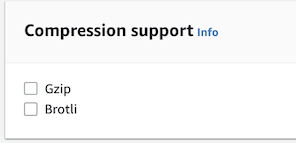

# CDN Support For Compression Dictionary Encoding
This is a collection of status and implementation notes for deploying [compression dictionary](https://github.com/WICG/compression-dictionary-transport) content encoding when using a CDN.

## Deployment Requirements
To successfully deploy compression dictionary transport (as it currently stands) from behind a CDN, requires a few things from the CDN:

1. Pass the `Use-As-Dictionary:` response header and `Sec-Available-Dictionary:` request header through between the client and the origin.
1. Pass `Accept-Encoding: sbr,...` and `Content-Encoding: sbr` through between the client and origin even if it can't decode the contents.
1. Support varying the cache of resources for both request headers (i.e. `Vary: Content-Encoding,Sec-Available-Dictionary`) so that sbr-encoded responses are cached by the dictionary that was used and are not intermixed with the full resource.

The first item, passing the new headers, is usually not a problem bot the last two tend to require special handling (or updated support) by middle-boxes, including CDN's.

## Edge Compute
Compressing content with external dictionaries will not work with edge-compute that needs to modify the payload of the response unless the compression is done after the edge compute runs. Practically, that means most edge-compute systems can route sbr-encoded responses but not modify the streams until support is added to the CDN for doing the actual compression. For these notes, we're specifically assuming compression is being done at the origin and passing through the CDN.

## Testing Support
There is a test page at (https://test.sharedbrotli.com/)[https://test.sharedbrotli.com/] ([code here](https://github.com/pmeenan/shared-brotli-test)) that can be used to test delivering sbr-encoded resources through a CDN. It will simulate requests from a browser that supports compression dictionary transport to the origin server which has implemented support for delivering sbr-encoded versions of a script file.

If you set the test page as the origin for a site on a given CDN, you can visit that site in a browser and test what parts of the flow work and iterate on making changes until it works (if it is possible for the given CDN).

# CDN-Specific Notes
These are the settings needed to make compression dictionary transport work (if possible) for the CDNs that have been tested to date as well as the date when the testing was done. Feel free to submit a Pull Request with CDN-specific notes for any that have not been tested yet or to update notes for an existing test.

## Amazon CloudFront :white_check_mark:
CloudFront supports passing custom content-encoding through the CDN and caching the artifacts. It doesn't work ing combination with "automatic compression" so all of the compression will need to be done by the origin.

To enable support, you need to create a custom [cache policy](https://docs.aws.amazon.com/AmazonCloudFront/latest/DeveloperGuide/controlling-the-cache-key.html#cache-key-create-cache-policy).

The policy needs to have the `Accept-Encoding` and `Sec-Available-Dictionary` headers added as cache keys:


The policy also requires that the automatic compression settings be disabled:



### S3-backed distribution
For distributions that are backed by resources stored in a S3 bucket, a [CloudFront function](https://docs.aws.amazon.com/AmazonCloudFront/latest/DeveloperGuide/cloudfront-functions.html) is needed for both the request and response to select appropriate assets from the bucket based on the compression and `Sec-Available-Key`. i.e. append `.sbr.<hash>` to the end of the file name and add the `Content-Encoding: sbr` response header.  It can also be done with a lambda as the origin instead of the S3 bucket with all of the selection and fallback logic in the lambda. Assuming the resources can be cached, the lambda should execute very rarely.

## Cloudflare :x:
Cloudflare [only supports gzip content-encoding](https://developers.cloudflare.com/support/speed/optimization-file-size/what-will-cloudflare-compress/#does-cloudflare-compress-resources) between the CDN and origin and will not pass arbitrary content-encodings through. Attempting to respond with an unsupported content-encoding results in an error.

The cache can support arbitrary headers as cache keys through page rules and specifying a [custom cache key](https://developers.cloudflare.com/cache/how-to/create-cache-keys/) (requires an enterprise plan).

## Fastly :white_check_mark:
By default, Fastly will [normalize the Accept-Encoding header](https://developer.fastly.com/reference/http/http-headers/Accept-Encoding/#normalization) before passing it to the origin. This can be fixed with a bit of VCL to pass the `sbr` encoding through:

```
if (req.http.Fastly-Orig-Accept-Encoding ~ "sbr") {
  set req.http.accept-encoding = req.http.accept-encoding ", sbr";
}
```

Once that is done, the content-encoding negotiation works perfectly and the cache supports `Vary` with the necessary headers, correctly serving 